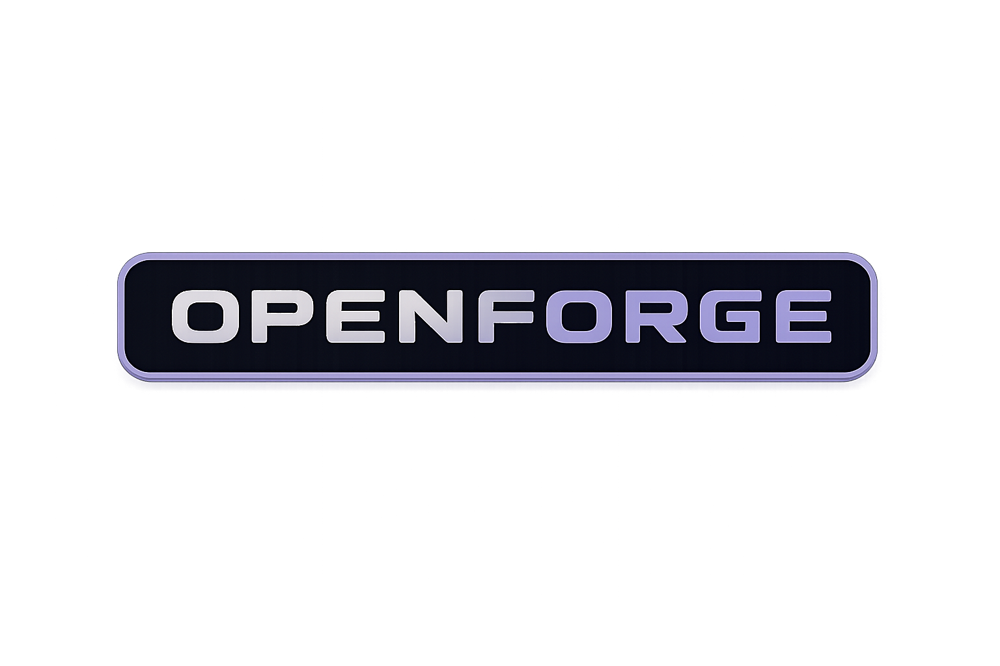

<div align="center">



# ⚒️ OpenForge

### *Forge intelligent code, locally.*

OpenForge adalah **local-first AI agent** yang sangat powerful — terminal, TUI, Web UI, dan Desktop dalam satu paket. Semua data, memory, dan kode Anda tetap di mesin Anda.

<br>

[](../../releases)
[](LICENSE)
[]()
[](#-tools-43)
[](#-skills-44)
[](#-providers-25)

[Quick Start](#-quick-start) · [Unified Home](#-unified-home--openforge) · [Versioning](#-versioning-semver-200) · [Tools](#-tools-43) · [Testing](#-testing)

</div>

---

## 🧠 Kenapa OpenForge?

> OpenForge adalah evolusi **The Great Consolidation** — penggabungan nama (dari OpenForge), arsitektur terpadu `~/.openforge/`, dan ekspansi UI/UX ke Web, TUI, dan Desktop.

- **🔒 Private by default** — tidak ada cloud, tidak kirim data, semua memory di `~/.openforge/`
- **⚡ Tools & Skills ekstensif** — 43 built-in tools, 44 skills (6 kategori), 41 intelligence modules
- **🔌 25 LLM provider** — termasuk llama.cpp lokal, Ollama, OpenAI, Anthropic, TokenRouter
- **📦 Unified home** — developer bisa `cd ~/.openforge/lib/` untuk lihat kode, data Anda di satu atap

---

## ✨ Highlights

<table>
  <tr>
    <td width="50%" valign="top">

#### 🧰 43 Built-in Tools
Semua tools ditulis dengan konkret: filesystem, terminal, git, planning, research, dokumentasi (PDF/DOCX/XLSX/PPTX), multimodality, MCP, hingga self-extension.

<br>

#### 🎯 44 Skills / 6 Kategori
Code Intelligence, Web Research, Creative, Communication, Data Analytics, DevOps — implementasi nyata (SQLite FTS5, real queries), fallback jujur saat tak tersedia.

<br>

#### 🧬 41 Intelligence Modules
Self-improve, healing, learning, confidence scoring, intent classification, persona adaptif, trajectory recording, pattern recognition — semua terintegrasi ke conversation loop.

    </td>
    <td width="50%" valign="top">

#### 🗄️ SQLite + FTS5 Memory
Percakapan dan memory dilengkapi index full-text search untuk pencarian instant lintas sesi.

<br>

#### 🖥️ Multi-Interface
- **Web**: Next.js 16 + React (sandbox preview, panel tools, streaming)
- **TUI**: Textual-style interaktif (sedang direwrite ke Textual di Phase 5)
- **CLI**: `openforge`, `openforge-chat`, `openforge-agent`, `openforge-gateway`, `openforge-doctor`

<br>

#### 🛡️ Security Boundary
`~/.openforge/` **diblokir dari terminal**; secrets di mode 600; `lib/` read-only (Phase 3).

    </td>
  </tr>
</table>

---

## 🚀 Quick Start

### ⚡ One-Line Install

**Linux / macOS:**

```bash
curl -fsSL https://raw.githubusercontent.com/neuralforgeio/openforge/main/scripts/install/install.sh | bash
```

**Windows (PowerShell):**

```powershell
irm https://raw.githubusercontent.com/neuralforgeio/openforge/main/scripts/install/install.ps1 | iex
```

Setelah install, buka terminal baru:

```bash
openforge --version       # → OpenForge v5.1.2
openforge provider list   # see all 25 providers
openforge-chat            # start chatting!
```

### Manual

```bash
git clone https://github.com/neuralforgeio/openforge.git
cd openforge
python -m venv .venv
# Windows: .venv\Scripts\activate
# Unix:    source .venv/bin/activate
pip install -e ".[dev]"
openforge setup
```

---

## 🏠 Unified Home `~/.openforge/`

```
~/.openforge/
├── lib/                 📦 Kode OpenForge — READ-ONLY (chmod 555)
│   ├── openforge/       # core library (config/state/provider)
│   ├── openforge_cli/   # CLI entry points
│   ├── openforge_web/   # Next.js Web UI
│   ├── agent/           # 41 intelligence modules
│   ├── skills/          # 44 skills (6 kategori)
│   ├── tools/           # 43 tools registry
│   └── providers/       # 25 provider catalog
│
├── workspace/           ✏️ File proyek Anda (RW)
├── memory/              🧠 MEMORY.md + USER.md
├── secrets/             🔑 API Key — mode 0o600
├── sessions/            🗂 Conversation history
├── tools/               🛠 Custom tool Anda
├── extensions/          ⚙️ User overrides
├── logs/                📜 Logs + audit trail
├── cache/               💾 Knowledge cache
├── .permissions/        🛡 Tool permissions
├── .versions/           📦 Release rollback snapshots
├── .backups/            🛟 Auto-backups DB
└── openforge.db         🗄 SQLite + FTS5 (semua memory)
```

> Path resolution dimediasi oleh `openforge/path_resolver.py` (Phase 3).

---

## 📦 Versioning (SemVer 2.0.0)

**Mulai v4.16.0**, OpenForge menganut [Semantic Versioning 2.0.0](https://semver.org/):

```
MAJOR.MINOR.PATCH
```

| Change | Contoh |
|--------|--------|
| **PATCH** (bug fix, backward compatible) | `4.16.0 → 4.16.1` |
| **MINOR** (new feature, backward compatible) | `4.16.0 → 4.17.0` |
| **MAJOR** (breaking change, user-requested) | `4.17.0 → 5.0.0` |

**Setiap rilis**: update `pyproject.toml`, `package.json`, `openforge_web/package.json`, `config.yaml` + tag + **GitHub Release**.

---

## 🛠 Tools (43)

<details>
<summary><b>File & Terminal</b></summary>

`read_file` · `write_file` · `file_patch` · `list_directory` · `search_files` · `file_info` · `run_terminal_command` · `terminal_exec` · `code_execution` · `process_snapshot`

</details>

<details>
<summary><b>Git & Planning</b></summary>

`git_status` · `git_diff` · `git_log` · `git_checkpoint` · `task_plan` · `todo_read` · `todo_write` · `plan_and_delegate` · `project_scaffold`

</details>

<details>
<summary><b>Knowledge & Research</b></summary>

`web_search` · `web_fetch` · `deep_research` · `read_pdf` · `read_docx` · `read_xlsx` · `read_pptx` · `memory_search` · `session_search` · `semantic_search`

</details>

<details>
<summary><b>Multimodal & Extension</b></summary>

`image_generation` · `image_understanding` · `browser` · `mcp_call` · `mcp_list_servers` · `delegate` · `create_tool` · `list_ports` · `list_background_processes` · `kill_background_process` · `generate_uuid` · `scratchpad_write` · `revert_file`

</details>

---

## 📚 Skills (44 file, 6 kategori)

| Category | Focus |
|----------|-------|
| **code_intelligence** | code review, explanation, refactoring, search, test generation, security audit, docs, performance profiling |
| **web_research** | web search, crawl, summarize, deep research, fact validation |
| **creative_media** | image generation/understanding, voice cloning, ASR |
| **communication** | meeting notes, summarization |
| **data_analytics** | data analysis, CSV/DB querying, spreadsheet operations |
| **devops_operations** | log analysis, monitoring, deployment automation |

Semua handler di `skills/<kategori>/<nama>/handler.py`.

---

## 🔌 Providers (25)

**Cloud**: OpenAI, Anthropic, OpenRouter, Groq, Mistral, Together, Fireworks, Cohere, Perplexity, DeepSeek, xAI, Gemini, Azure, HuggingFace, Cerebras, SambaNova, TokenRouter, Databricks
**Local**: llama.cpp, Ollama, LM Studio, vLLM, LocalAI
**Custom**: endpoint OpenAI-compatible

---

## 🧪 Testing

```bash
# Python test suite (1,097 tests)
python -m pytest tests/ -q --ignore=tests/integration

# Frontend
cd openforge_web && npm run build && npx vitest run

# Live llama.cpp E2E (optional)
$env:FORGE_E2E_LLAMACPP="1"
python -m pytest tests/test_llamacpp_real.py -v
```

---

## 🔄 Upgrade & Migration

Struktur baru (`~/.openforge/`) bersifat **user-friendly**. Migrasi dari format lama diletakkan di Phase 3:

```bash
openforge migrate    # otomatis: ~/.openforge → ~/.openforge, backups, setup LOCK, verifikasi doctor
```

Semua langkah migrasi dijamin **reversible** dengan backup di `~/.openforge/.backups/`.

---

## 📜 License

```
MIT License — Copyright (c) 2026 Dearly Febriano Irwansyah
```

---

<div align="center">

<sub>
Built 🔨 by **Dearly Febriano Irwansyah** (solo developer, 🇮🇩 Indonesia)<br>
Inspired by OpenCode • Engineered dengan hati • *Forge intelligent code, locally.*
</sub>

</div>
